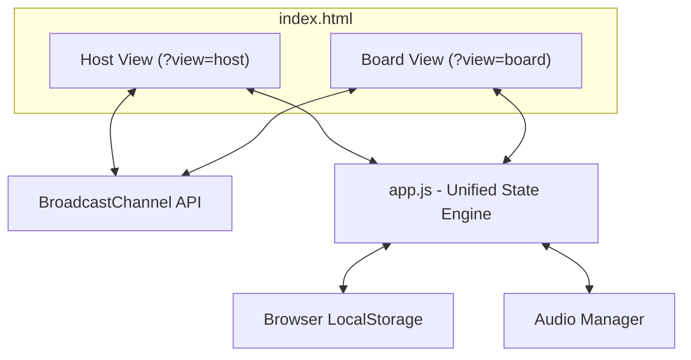

# Technical Architecture Specification: Local Jeopardy-esque Game

> **BMAD Phase 4: Verification & Integration**  
> **Status:** Approved  
> **Version:** 1.10.0  
> **Owner:** Architect Agent / Developer Lead

---

## 1. System Architecture Diagram



## 2. Component Design

### A. Core State Engine (`src/js/app.js`)
A single, modular state container that manages the active session. This engine processes game states and coordinates communication between `host.html` and `board.html`.
*   **State Structure:**
    ```javascript
    {
      teams: [
        // Array of 2 to 4 teams dynamically defined
        { 
          id: 1, 
          name: "Team 1", 
          score: 0, 
          color: "#3b82f6",
          finalWager: null, // Captured in final round ($0 to current score)
          finalResult: null // 'correct' | 'incorrect' (judging state)
        }
      ],
      deck: {
        singleJeopardy: { categories: [] }, // 5 categories with 5 clues each
        doubleJeopardy: { categories: [] }, // 5 categories with 5 clues each (doubled values)
        finalJeopardy: { category: "", question: "", answer: "" } // single clue
      },
      currentClue: null, // Active Clue: { category, question, answer, value, isDailyDouble }
      currentWager: null, // Bidding wager for Daily Double
      activeBuzzedTeamId: null, // Team currently allowed to answer
      spentClues: [], // Array of "round-category-value" keys
      deckName: null, // Filename of the loaded game board CSV
      gamePhase: "setup", // "setup" | "single_jeopardy" | "double_jeopardy" | "final_jeopardy" | "completed"
      categoryIntroIndex: null, // null | number (0 to N-1) during active category reveal sequence before round start
      settings: {
        clueFontSizeMultiplier: 1.0, // Ranges from 1.0 (default) to 1.8 (extra large)
        soundEnabled: true
      }
    }
    ```

### B. Real-Time Sync Broker (`src/js/app.js`)
Synchronizes operations in real-time across screens using a dual-channel synchronization layer:
1. **BroadcastChannel API:** Native, low-latency samedomain tab/window synchronization (`jeopardy_game_channel`).
2. **HTML5 Window postMessage Fallback Bridge:** Standard browser message exchange (`window.postMessage`) between programmatically opened child displays and the host window. This fallback provides seamless, bi-directional state synchronization offline under the `file://` protocol where modern same-origin scopes normally block the BroadcastChannel.
   * **Connection Healing Heartbeat:** The spectator board runs a periodic `setInterval` (every 2000ms) that pings the parent window (`window.opener.postMessage`) with a `'SYNC_REQUEST'`. Upon receiving this ping, the reloaded Host Console instantly re-registers the active spectator window reference in its `directWindows` set and broadcasts the latest state, ensuring bulletproof bi-directional recovery without manual refreshes.
   * **Reload-Queue Flush Synchronization:** When triggering a session reset or restart on the Host Console, the host broadcasts the fully wiped `SYNC_STATE` (rather than a simple phase flag) and delays its own page reload by `150ms` using `setTimeout`. This allows the browser's outbound postMessage and BroadcastChannel pipelines to flush fully before document tearing.
*   **Sync Message Protocol:**
    ```javascript
    // Trigger clue display on spectator screen
    { action: "SHOW_CLUE", payload: { category: "Science", value: 200 } }
    
    // Assign active buzzer team
    { action: "SET_ACTIVE_TEAM", payload: { teamId: 1 } }
    
    // Set Daily Double wager value
    { action: "SET_WAGER", payload: { wager: 800 } }
    
    // Apply score update, play sound cue, and close clue overlay if keepOpen is false.
    // If keepOpen is true, keeps the clue overlay open and resets buzzer visuals so other teams can answer.
    { action: "RESOLVE_CLUE", payload: { spentClues: [...], teams: [...], isCorrect: false, isIncorrect: true, keepOpen: true } }
    
    // Reveal the correct answer on the spectator board overlay
    { action: "REVEAL_ANSWER", payload: { answer: "Mitochondria" } }
    
    // Trigger final jeopardy category screen
    { action: "SHOW_FINAL_CATEGORY", payload: { category: "World Capitals" } }
    
    // Trigger final jeopardy clue and play 30-second ticking clock sequence
    { action: "SHOW_FINAL_CLUE", payload: { clue } }
    
    // Advance to next game phase
    { action: "SET_PHASE", payload: { gamePhase: "double_jeopardy" } }
    
    // Reset/Sync whole state
    { action: "SYNC_STATE", payload: { state } }
    ```

### C. Presenter Console View (`host.html` & `src/js/host-ui.js`)
Renders the controller screen. Displays a compact grid of clues, quick buttons to view answers, buttons for each team to manually mark them as the "First to Buzz", score increments/decrements, and configuration setup.
*   **Deck Name Confirmation:** Displays the loaded board filename (e.g., `Active deck: demo_board.csv`) dynamically on the starting setup panel, providing visual verification. The filename persists when restored from `localStorage`.
*   **Daily Double Validation:** Enforces a minimum of $5 and a maximum of the higher of: the team's current score OR the maximum clue value in the active round. Validations are strictly gameplay-blocking (early return gates halt submissions), but displayed fully in-line via a dynamic `#dd-wager-error` node and HSL red border highlights, completely eliminating browser native alerts.
*   **Final Jeopardy Automated Dashboard:** Renders a two-step state-driven presenter dashboard:
    1. *Wager Capture View:* Lists all eligible teams (scores > 0), provides validated wager inputs, and provides a "Reveal Category" broadcast action button. Wager validations are strictly gameplay-blocking (returning early and displaying warnings inside unique per-team dynamic `.inline-error` containers) to prevent clue reveals until all entries are correct.
    2. *Judging View:* Triggered once wagers are submitted. Displays the clue question and answer, provides dedicated per-team **Correct** and **Incorrect** scoring buttons (updating scores by wager amount instantly), and keeps the "Complete Game" button disabled until all participating teams are graded.
*   **Victory Session Summary & Session Restart:** In the `completed` state, displays a clear summary of the victory state (winning team and score) and renders a prominent **Reset and Setup New Game** button. Clicking this triggers `resetGameState()` (clearing wagers, scores, and grading records but preserving the loaded CSV game deck), broadcasts the fully reset `SYNC_STATE`, and executes a delayed reload (`150ms`) to securely flush messages.
*   **Start Game State Purge:** Clicking "Start Game Session" in the setup panel triggers a final active state purge to wipe any residual spent cards or active wagers from memory, establishing a 100% pristine start.
*   **Responsive Layout:** The presenter screen utilizes a `.host-layout` grid configuration (`280px minmax(0, 1fr)`) that automatically stretches to occupy 100% of the browser window's width. To prevent horizontal overflow from long, non-wrapping clue preview text, all main panels (`#host-main`), category headers, and individual clue cards (`.host-clue-card`) employ explicit `min-width: 0` constraints, allowing grid columns to shrink fluidly and adapt to any viewport.
*   **Presenter Settings Panel:** Features sidebar settings controls allowing real-time clue font scale range updates, sound effects toggle buttons, and collapsible dynamic text/color active team detail inputs. Mid-game edits immediately trigger a state broadcast, synchronizing and redrawing scoreboard cards on both screens dynamically.
*   **Sequential Category Introductions Controller:** Renders a dedicated category reveal card inside `#host-clue-grid` if `categoryIntroIndex` is active, letting the host step through categories back and forth sequentially using **Next** and **Back** controls, or skip them entirely. It handles wagers and clue click lockouts during the introduction phase.

### D. Spectator Display View (`board.html` & `src/js/board-ui.js`)
A purely visual, immersive display. Listens to the `BroadcastChannel` and performs smooth, high-framerate transitions (e.g., expanding selected clues, running countdown animations, triggering correct/incorrect sound effects, and rendering rolling score updates).
*   **Clue Overlay Persistence:** On `RESOLVE_CLUE` reception, if `keepOpen` is `true`, updates team scores, clears active buzzed visual, plays incorrect sound cue, but does not close the overlay. Otherwise, standard full closing transition is triggered.
*   **Answer Reveal Display:** When a `REVEAL_ANSWER` message is received, the spectator board renders the correct answer text in a visually distinct style (e.g., green-highlighted, uppercase) below the clue question inside the active zoom overlay. This element remains visible until the overlay is dismissed.
*   **Winner Reveal Screen:** In the `completed` phase, replaces standard grids with a fullscreen glassmorphic podium display. The panel sorts teams by score, determines the team(s) with the highest score, and displays a prominent victory card proclaiming the **Champion** or **Joint Champions** (handling tie-breakers) with an animated, glowing team-colored border. It also draws a ranked list of all remaining runner-up teams below.
*   **Strict setup Phase Wiping:** If the spectator board receives a state or phase transition specifying the `'setup'` phase, it aggressively clears all internal in-memory state variables (spent clues array, active clue, wager values, and team registers/scores) to guarantee a zero-residue start.
*   **Pristine Presentation Screen (Zero UI):** The Spectator Board contains zero interactive controls or sound buttons. Web Audio API initialization is cleanly unblocked by listening for a one-time click gesture anywhere on the spectator page, and all subsequent audio enablements/disablements are dynamically driven by state settings updates broadcasted from the presenter console.
*   **Sequential Category Introductions Slide:** Renders a premium, fullscreen glassmorphic slide overlay displaying the active category name in giant typography if `categoryIntroIndex` is active, playing a soft select chime when slides transition and fading out smoothly when the round starts.

### E. Audio Manager (`src/js/audio.js`)
Utilizes the Web Audio API or bundled low-overhead synthesized sounds to produce clean audio triggers completely offline. Added `playVictoryFanfare()` to generate a triumphant multi-oscillator synthesized arpeggio sweep upon winner announcement.
*   **Centralized Sizing & Audio Sync:** The spectator board UI receives settings state broadcast packets and applies the `gameState.settings.soundEnabled` boolean directly to toggle `gameAudio.enabled`, shutting down or restoring sound cues on demand under exclusive host control.

---

## 3. Data Contract: CSV Game Deck Schema
To keep trivia writing as seamless as possible, game decks are stored and uploaded as a single **CSV (Comma-Separated Values)** file. The Host Console parses this flat table directly into the standard multi-round JavaScript state.

### CSV Columns Schema:
1.  **`Round`** *(Required)*: Must be `"Single"`, `"Double"`, or `"Final"`.
2.  **`Category`** *(Required)*: The trivia category name (e.g., `"Science"`, `"Pop Music"`).
3.  **`Value`** *(Required for Single/Double)*: Point value for the clue (e.g., `200`, `400`, `800`, `1000`). Left blank for `"Final"`.
4.  **`Question`** *(Required)*: The clue prompt read by the host and shown on the Board Screen.
5.  **`Answer`** *(Required)*: The correct answer sheet solution shown to the host.
6.  **`IsDailyDouble`** *(Optional)*: Set to `"TRUE"` to flag this clue as a hidden Daily Double bidding card.
7.  **`MediaType`** *(Optional)*: Specifies rich media. Must be `"none"` or `"image"`.
8.  **`MediaURL`** *(Optional)*: A local relative path (e.g., `"assets/mars.jpg"`) or absolute web link pointing to the image to display inside the clue modal.

### Standard CSV Deck Template Example:
```csv
Round,Category,Value,Question,Answer,IsDailyDouble,MediaType,MediaURL
Single,Science,200,"What is the powerhouse of the cell?",Mitochondria,FALSE,none,
Single,Science,400,"What does CPU stand for?",Central Processing Unit,FALSE,none,
Single,World History,600,"Identify this legendary Roman amphitheater.","Colosseum",TRUE,image,"assets/colosseum.jpg"
Double,Advanced Science,400,"What particle has no electric charge?",Neutron,FALSE,none,
Double,Space,800,"Identify this active volcano on Io, a moon of Jupiter.",Loki,TRUE,image,"https://images.unsplash.com/photo-1541872703-74c5e44368f9?w=800"
Final,World Capitals,,This city is the southernmost capital of an independent nation.,"Wellington (New Zealand)",FALSE,none,
```

---

## 4. Verification & Testing Strategy
*   **Offline / Local File Bridge Verification:** Run the application directly off the local hard drive under the `file://` protocol. Open the spectator board from the console and verify that clue selections, judging events, and scoring actions synchronize instantly (<16ms delay) across windows via the `postMessage` fallback bridge.
*   **Broadcast Synchronization Verification:** Verify that messages sent via the `BroadcastChannel` are delivered in under 16ms (1 frame) when running in a served local host environment to ensure perfect visual synchronization between the Presenter screen and Spectator screen.
*   **State Recovery Validation:** Verify that manual reloads of either `host.html` or `board.html` pull current state instantly from `localStorage` (if permitted) and request a full state broadcast sync if needed.
*   **Offline Verification:** Execute the game in a sandbox with network interfaces fully disabled to guarantee local-first independence.

---

## 5. Single-File Compilation & Unified Routing Architecture

To simplify deployment and offline distribution, the application can be bundled into a **single, fully self-contained HTML file** (`index.html`) using a unified routing and asset inlining framework.

### A. Unified View Routing Engine
Instead of keeping separate `host.html` and `board.html` entrypoints, the single-file architecture uses **URL Query Parameter Routing** to determine which view dashboard is rendered:
*   `index.html?view=host` (or default `index.html`): Renders the Host Presenter Console container.
*   `index.html?view=board`: Renders the Spectator Board container.

#### Routing Implementation:
```javascript
// URL Query Parameter Router inside index.html's startup script
document.addEventListener('DOMContentLoaded', () => {
  const urlParams = new URLSearchParams(window.location.search);
  const activeView = urlParams.get('view') || 'host'; // Defaults to host console

  const hostContainer = document.getElementById('host-app-root');
  const boardContainer = document.getElementById('board-app-root');

  if (activeView === 'board') {
    hostContainer.style.display = 'none';
    boardContainer.style.display = 'block';
    initializeBoardView(); // Loads board-ui.js logic
  } else {
    boardContainer.style.display = 'none';
    hostContainer.style.display = 'block';
    initializeHostView(); // Loads host-ui.js logic
  }
});
```

### B. Dynamic Child Window Spawning
With query-parameter routing, the Host Console opens the Spectator Board by pointing back to the same file but with the corresponding route:
```javascript
// Inside Host UI action handler
openBoardBtn.addEventListener('click', () => {
  const boardWindow = window.open('index.html?view=board', '_blank');
  if (boardWindow) {
    directWindows.add(boardWindow);
  }
});
```

### C. Build-Time Asset Inlining (Compilation Pipeline)
A dedicated build script compiles development assets (independent HTML templates, CSS style sheets, and JS files) into the single-file distribution:
1.  **HTML Merging:** The script merges the layouts of `host.html` and `board.html` into a single `index.html` skeleton using layout roots (`<div id="host-app-root">` and `<div id="board-app-root">`).
2.  **Style Inlining:** Locates `<link rel="stylesheet">` files (like `style.css`) and embeds their contents inside a `<style>` block.
3.  **Script Inlining:** Resolves all script elements (like `app.js`, `audio.js`, `host-ui.js`, and `board-ui.js`) and compiles their code directly into separate `<script>` nodes inside the HTML.
4.  **Rich Assets Compilation:** Media (icons, background patterns) is converted to **Base64 Data URIs** and inlined directly.
5.  **Output:** A single, lightweight, self-contained HTML file (approx. ~120KB) that requires zero external server, zero stylesheet, and zero asset fetches to run.


