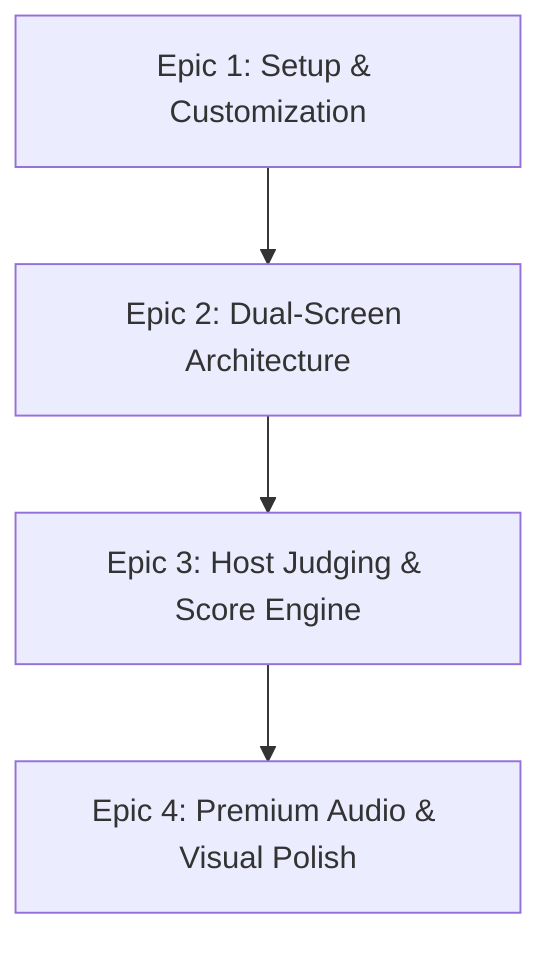

# Product Requirements Document (PRD): Local Jeopardy-esque Game

> **BMAD Phase 2: Planning**  
> **Status:** Approved  
> **Version:** 1.11.0  
> **Owner:** PM Agent / Human Stakeholder

---

## 1. Product Vision
To build the ultimate local trivia game system that delivers a TV-quality game show experience directly inside a web browser. With zero external server dependencies, rich glassmorphic aesthetics, spatial sound cues, and a fluid dual-screen setup, this local Jeopardy-esque platform elevates casual trivia night, classroom quizzes, and team-building events into a premium, interactive spectacle.

## 2. User Personas & Core Workflows

### A. The Game Host (Presenter)
*   *Needs:* Absolute control over the state of the game. Needs a dedicated Host Console that displays the clue answers and manual buttons to trigger score adjustments and manually assign who buzzed in first.
*   *Workflows:* Launches the Host Console, reads the active clue aloud, observes players' physical external buzzers, manually selects the team that buzzed in first on the Host Console, judges their answer, and applies positive/negative scores.

### B. The Competitors (Players/Teams)
*   *Needs:* High-contrast visual feedback, real-time scoreboard updates on the main screen, and clear cues for clue selection.
*   *Workflows:* Play in front of the main projected screen, use their standalone physical offline buzzers to compete, and answer verbally.

### C. The Audience (Spectators)
*   *Needs:* Immersive visual and audio feedback, fluid transitions, and clear animations when questions are selected, answers judged, or scores updated.
*   *Workflows:* Watch the primary projector or TV screen showing the Board Screen in full-screen grandeur.

---

## 3. Scope & Epic Sharding

### Epic 1: Game Setup & Customization
*   **Import CSV Game Deck:** The Host can load a single `.csv` file containing categories, clues, answers, point values, Daily Double flags, and optional media metadata (image URLs) for all rounds.
*   **Deck Name Display:** The starting setup screen dynamically displays the filename of the active loaded board deck (either upon new upload or when restored from the cache) to provide the host with clear visual confirmation before kickoff.
*   **Dynamic Team Registration:** Configure between 2 to 4 teams dynamically, customize team names, assign colors, and preset initial scores.
*   **Host Settings Panel (Presenter Console):** Features a sleek, glassmorphic panel in the presenter sidebar enabling real-time adjustments of clue font sizes (scaling clue overlay fonts across screens dynamically), dynamic mid-game team edits (names and colors modified in real-time without resetting scores), and dynamic toggling of sound effects.
*   **Clean Board Display:** The Spectator Board features zero control buttons or sound toggles, maintaining a pristine, distraction-free screen for the audience. Audio context initialization is handled seamlessly via an invisible page-wide user click unblocker, while enabling/disabling sounds is routed exclusively through the Host Settings Panel.

### Epic 2: True Dual-Screen Architecture
*   **Spectator Board Screen (`board.html`):** Full-screen primary display designed for a TV or projector. Shows a grid of categories and clues, beautiful clue zoom animations (supporting embedded images loaded via URL), current scores, and designated layouts for Single/Double Jeopardy grids, Daily Double bidding cards, and the Final Jeopardy countdown. Has NO control buttons.
*   **Answer Reveal on Board:** When the Host triggers an answer reveal, the spectator board displays the correct answer text in a visually distinct style below the clue question inside the zoom overlay. This allows the audience to see the answer after judging is complete, before the overlay closes.
*   **Host Console Screen (`host.html`):** Private dashboard for the presenter. Shows grid states, absolute values, underlying correct answers, active state buttons (correct/incorrect/reset), manual buzzer trigger buttons, manual score overrides, and transitions for moving to the next round. Renders responsively and dynamically fits the full width of the browser window without requiring horizontal scrolling.
*   **Native & Offline Synchronization:** Uses a dual-channel synchronization architecture featuring the HTML5 `BroadcastChannel` API and a direct `window.postMessage` messaging bridge. The `postMessage` bridge acts as an automatic fallback, enabling full real-time action synchronization (sub-16ms latency) offline under the `file://` protocol where modern browsers scope tab origins restrictively. This eliminates the need for any local server during setup or gameplay. Includes a **Connection Healing Heartbeat** that pings every 2000ms from the Spectator Board to auto-heal severed messaging bridges after host reloads, and a **Reload-Queue Flush Sync** that delays host reloads by 150ms to allow reset packets to transmit completely without tearing.
*   **Single-File Distribution Option:** The application supports an optional build target compiling both screens, stylesheets, script files, and vector iconography into a single, dependency-free `index.html` file. This single file uses a URL query parameter router (`?view=board` vs `?view=host`) to dynamically spawn the spectator window from the presenter console offline.

### Epic 3: Host Judging & Traditional Game Mechanics
*   **Three-Round Game Flow:**
    *   **Round 1: Single Jeopardy:** standard category-clue grid (e.g., $200 - $1000). Features one hidden **Daily Double**.
    *   **Round 2: Double Jeopardy:** Second category-clue grid with doubled point values (e.g., $400 - $2000). Features two hidden **Daily Doubles**.
    *   **Round 3: Final Jeopardy:** Displays the single category first, allowing all teams with positive (> $0) scores to submit their secret point wagers. Features an automated Host Console panel to capture each team's wager first. Displays the final clue and triggers the traditional 30-second countdown music. The Host judges each participating team using individual Correct/Incorrect buttons, which automatically apply the point adjustments (wagers added or subtracted) and synchronize the scores instantly.
*   **Sequential Category Introductions:** Prior to launching active grid gameplay in Single and Double Jeopardy rounds, the Host Console initiates a category reveal sequence. The presenter clicks through categories back and forth sequentially using **Next** and **Back** controls, or skips the introduction. The Spectator Board mirrors this by rendering fullscreen glassmorphic category slides showing names in giant, neon-gradient typography, complete with dynamic sound indicators on slide transitions, replicating a premium TV game show opening.
*   **Daily Double Bidding:** When a Daily Double is revealed, the Board Screen locks out normal buzzers. The selecting team makes a wager. The Host Console enforces a valid wager size: a minimum of **$5**, and a maximum of **either the team's current score OR the round's maximum clue value (e.g., $1000 for Single, $2000 for Double), whichever is higher**. Validations are strictly gameplay-blocking but executed fully in-line using cohesive in-line warnings and red-highlighted inputs, completely prohibiting intrusive native browser alert dialogs. The Host inputs the wager, reads the clue, and judges their single-team answer.
*   **Manual Buzzer Assignment:** Since physical buzzers are external hardware, the Host Console displays direct "Team Buzzed" buttons. The Host clicks the button corresponding to the team that physically buzzed first.
*   **Lockout & Timer:** When a team is selected, the board displays their name/color and initiates a countdown timer.
*   **Judging Controls:** The Host selects "Correct" (awards points, closes clue) or "Incorrect" (deducts points, locks out this team from answering this clue again, and leaves the spectator board clue overlay open for other teams to attempt).
*   **Multi-Team Retries:** Each team has a chance to answer the clue. If a team answers incorrectly, they are penalized and disallowed from buzzing in again for that clue. The spectator board's clue overlay stays open. The overlay only closes and marks the clue spent when:
    1. A team answers correctly.
    2. All registered teams have attempted the clue and answered incorrectly.
    3. The Host clicks "Skip / Nobody Answered".
*   **Final Jeopardy Wager and Judging UI:** The Host Console features a dedicated, full-screen Final Jeopardy dashboard that automatically activates during the final round:
    1. **Wager Capture View:** Filters out teams with zero or negative scores. Displays a clean input form showing each eligible team, their maximum allowed wager, and a numeric text box. Includes a "Reveal Category on Spectator Board" action button.
    2. **Reveal Clue Action:** Validates wagers strictly in-line (blocking gameplay progression and drawing distinct red highlight warning labels for any invalid input, without using native system alerts), writes them to the state, broadcasts the final jeopardy clue overlay, and plays the ticking clock think music.
    3. **Judging View:** Displays the clue question and correct answer for host reference. Shows each team along with their wager, equipped with per-team **Correct** and **Incorrect** scoring buttons. Clicking these applies the points and synchronizes the boards immediately. Disables the complete game button until all participating teams have been judged.
*   **Winner Reveal Screen & Reset Flow (Game Completion State):** Once the Host clicks "Complete Game Session" on the Final Jeopardy Judging Panel, the application transitions to the `completed` state:
    1. **Victory Screen (Spectator Board):** The standard grid is replaced by a high-contrast, premium Victory reveal panel. It identifies the team with the highest final score and proclaims them as the **Champion** using a fullscreen glassmorphic card customized in their team's HSL border color with glowing neon animations. 
    2. **Joint Victories / Tie Handling:** If there is a tie for first place, the reveal panel announces a joint victory, listing all tied teams together as Champions.
    3. **Runners-Up Leaderboard:** A secondary, polished podium ranks all remaining participating teams (including those with negative or zero scores) in order, displaying their final scores.
    4. **Host Reset Controls:** The Host Console replaces the grid with a Game Completed control panel summarizing the victor and enabling a **Reset and Setup New Game** button. Clicking this triggers a complete session wipe, returns both displays to the Setup/Registration screen, and resets all wagers and grading properties cleanly. It transmits a pristine `SYNC_STATE` broadcast to clear all active grids and uses a delayed reload to guarantee complete delivery.
    5. **Pristine Local Wipes:** Upon transition to the setup phase, both windows execute absolute local memory wiping of spent clues and active wagers to prevent residual grid marks or state leakage.
*   **Answer Reveal Button:** A dedicated "Reveal Answer" button on the Host Console broadcasts the correct answer text to the spectator board's clue overlay. The Host can trigger this at any time while a clue is active—after judging, after a skip, or simply to show the audience the answer before closing.
*   **Quick Score Buttons:** In addition to the formal buzzer→judge workflow, the Host Console provides streamlined per-team "+$value" and "−$value" buttons (where `$value` is the active clue's point value) directly in the clue control drawer. This allows the Host to rapidly award or deduct points for the active clue to any team with a single click, without requiring the full buzzer claim→correct/incorrect flow. This is especially useful for informal play or when the Host simply wants to assign points quickly.

### Epic 4: Premium Audio & Visual Polish (The Wow Factor)
*   **Dynamic Visuals:** HSL custom property variables supporting smooth dark transitions, premium glassmorphism, responsive grid layout, and custom typography (e.g., Outfit/Inter via Google Fonts).
*   **Sound FX Engine:** Integrated synthesized offline audio chimes for Game Start, Clue Selection, Buzzer Trigger, Correct/Incorrect, Daily Double, Final Jeopardy Think-Music, and the final Victory Fanfare. Audio can be toggled on/off dynamically only via the Host Settings Panel, maintaining centralized control.
*   **Scoreboard Animations:** Smooth numeric counters that roll numbers up/down dynamically on point changes.

---

## 4. Non-Functional Requirements (NFRs)
*   **Local-First Design:** Zero external API or database calls. All assets, scripts, and stylesheets must run offline.
*   **Presenter Synchronization:** Action commands (such as showing a clue or awarding points) must sync from `host.html` to `board.html` instantly. This synchronization must function seamlessly offline and with zero servers via `window.postMessage` and direct parent-to-child browser window pointers.
*   **Session Persistence:** If the browser crashes, game progress is saved in `localStorage` (where available/allowed) and can be resumed with a single click.
*   **Highly Responsive UI:** The board must adjust beautifully across resolutions (from laptop displays to 4K projectors) without letterbox distortion.

---

## 5. Out of Scope for Phase 1
*   Online web-socket multiplayer (players buzzing from separate remote smartphones).
*   User accounts or cloud board repositories.
*   Automatic speech-to-text or voice answer recognition.
*   Key-down listener configurations (since buzzing is fully manual by the host).

---

### [BMAD Review Checklist]
- [x] Define the format for the JSON/CSV Game Deck (Provide a standard JSON schema).
- [x] Confirm manual host-driven buzzer input mechanism.
- [x] Agree on true dual-screen BroadcastChannel synchronizations.

